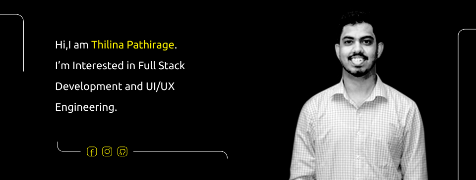

  

`Hi there, I'm Thilina Pathirage and I'm a software engineering undergraduate in Sri Lanka. I am interested in Web Development and UI/UX Engineering. I am passionate about developing enterprise grade applications with Java too. My web development stack is mainly the MERN stack. But I am comfortable with other stacks also. I have hands on experience with mobile applications development technologies like Flutter and Firebase. And also I'm looking forward to collaborate in open source and commercial projects.`

`Some interested technologies`  

